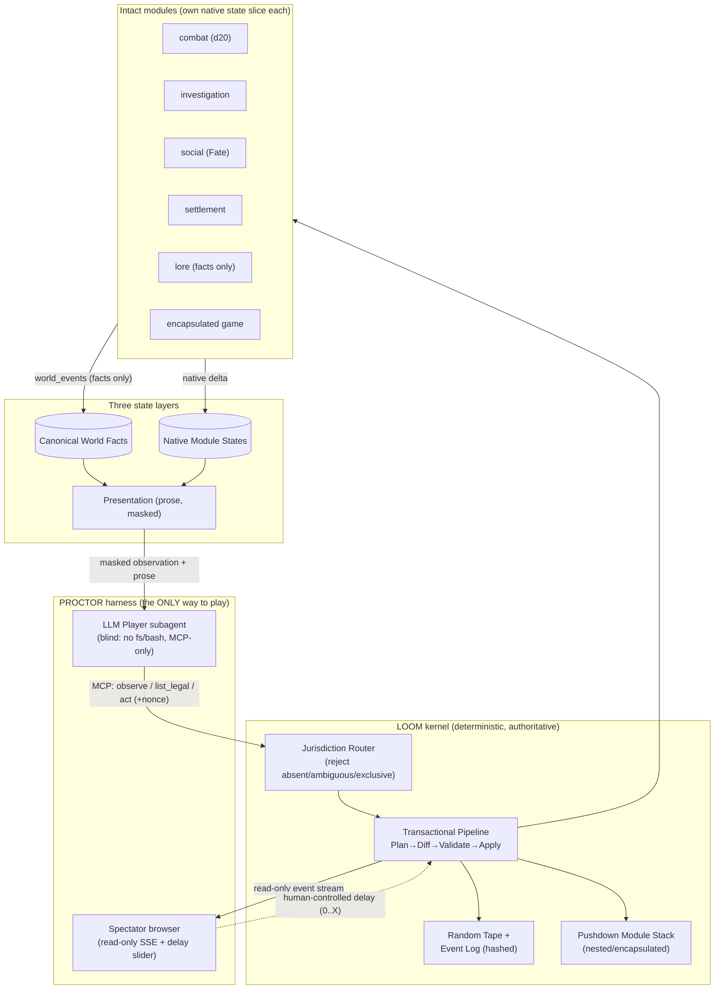

# LOOM — Architecture

> A deterministic, prose-first **game operating system** that hosts *intact* rule systems by
> jurisdiction and renders a deep, continuous world. Built on the proven substrate of
> `zork-unlimited` ([citations inline]) and governed by RuleMesh ([00-REVIEW-FINDINGS.md](00-REVIEW-FINDINGS.md)).
> All play happens through PROCTOR ([02-PROCTOR-MCP-HARNESS.md](02-PROCTOR-MCP-HARNESS.md)).

## 1. The one-sentence design

> **Keep AdventureForge's pure `(state, action) → state` reducer and its injected `Rules` resolver
> seam — but give every module its OWN native state slice instead of one shared `vars` bag, route
> each action to exactly one jurisdiction owner, and never translate numbers between systems.**

That single change turns the normalized monolith into a jurisdiction kernel without discarding any of
the engineering that already works (purity, seeded RNG, content hashing, trace replay, Zod contracts).

## 2. Three state layers (the spine)

```
┌─ Presentation State ─────────────────────────────────────────────┐  derived, regenerable,
│  role-scoped observations + rendered prose. NEVER mutates facts.  │  may NOT write down
├─ Native Module State ────────────────────────────────────────────┤
│  each module owns its own slice: D&D combat owns hp/ac/initiative;│  one writer per slice;
│  an investigation module owns clues; a settlement owns resources. │  no cross-system math
├─ Canonical World Facts ───────────────────────────────────────────┤
│  identity · location · possession · allegiance · relationship ·   │  small, typed, shared;
│  known_information · public_reputation · recorded_event ·         │  modules READ permitted
│  completed_objective · survival_status                            │  facts, write via events
└───────────────────────────────────────────────────────────────────┘
```

Rule: a module may **read** permitted canonical facts, but may only apply consequences **its own rules
already define**. If the D&D module records "broken arm" as a world fact, a separate chase module does
*not* get an automatic converted penalty — it reacts only if *its* rules contain a procedure for that
fact. This is the death of numerical crosswalks, enforced structurally.

This replaces AdventureForge's single `GameState.vars` (`src/core/state.ts`) with a **map of
per-module native states + a typed fact store**. The reducer seam (`src/core/engine.ts`) is unchanged;
the *granularity of what it reduces over* changes.

## 3. Module manifest (the registration contract)

Every module declares (adapted from RuleMesh v0.2 in `ttrpg-feedback.md` §8):

```yaml
id: "publisher.system.edition.module"      # e.g. "wotc.dnd.5e-srd.combat"
version: "semver + content_hash"
source: "exact document + section"          # faithfulness anchor
license: { identifier, attribution, approved_for_implementation: bool }
fidelity: whole-system | native-subsystem | complete-game
jurisdiction:                               # the routing key — see §4
  scales:    [character, squad, settlement, faction, empire, abstract]
  domains:   [combat, investigation, social, economy, exploration, governance, warfare]
  phases:    [downtime, encounter, council, auction, ...]
  entity_selectors: ["kind:pc", "tag:soldier", ...]
owns:  { native_state_paths: [...] }        # the ONLY writer of these paths
reads: { canonical_fact_types: [...] }
timing_model: "cyclic-init | igougo | priority-stack | spotlight | simultaneous | phase-pump"
information_model: "perfect | hidden-hand | fog"
random_primitives: [d20, dice-pool, card-draw, deterministic]
entry_requirements: []
exit_events: []                             # the terminal world-facts it may emit
source_extension_points: []                 # where it may legally host a nested module
invariants: []
forbidden:                                  # validated at registration — reject if violated
  numerical_crosswalks: true
  normalized_outcomes: true
  universal_base_statistics: true
  runtime_rule_generation: true
```

Each module ships its own **Zod schema** (the AdventureForge "schema-is-the-contract" pattern,
`src/*/schema.ts`) for its native state and its actions, plus its own **static validator** (the
`src/validate/rpg_validator.ts` winnability/fairness-proof pattern) proving its content is solvable —
independently, per jurisdiction.

## 4. Jurisdiction router (the kernel's core decision)

```
route(input, world) :
  action       = parse(input)                 # LLM proposes structured action(s); NEVER resolves
  candidates   = modules.where(m => m.jurisdiction matches action.{scale, domain, phase, entities})
  switch candidates.length:
    0 -> REJECT "no authority"                 # fail loud (AdventureForge integrity-guard ethos)
    1 -> owner = candidates[0]
    >1 -> owner = disambiguate(candidates, action) or REJECT "ambiguous/exclusive authority"
  return owner
```

**Compatibility is a routing decision, not a merge** (RuleMesh):

| relation | meaning | allowed |
|---|---|---|
| orthogonal | different domain/scale/phase/entities | ✅ |
| sequential | one procedure ends before the next starts | ✅ |
| nested | a module invokes another via a **source-defined** extension point | ✅ (pushdown, §7) |
| encapsulated | a complete game runs as an in-world activity, returns terminal facts | ✅ |
| **exclusive** | two modules answer the **same** mechanical question incompatibly | ❌ **rejected** |

No improvised adapter ever reconciles an exclusive collision. This is the inverse of my retired UUGAA
"conflict hook picks a winner" — here a true collision is a configuration error, surfaced, not patched.

## 5. The module interface (one function, faithful to source)

```ts
// Every module implements exactly this. The kernel never reinterprets a native outcome.
execute(
  nativeState: ModuleState,            // only this module's slice
  observation: RoleObservation,        // masked for the acting role
  action: ValidatedAction,             // already routed + legality-checked by the module
  tape: RandomTape                     // immutable pre-allocated draws (see §6)
): {
  nativeStateNext: ModuleState,
  worldEvents: WorldEvent[],           // FACTS, not converted statistics
  observationsNext: RoleObservation[],
  control: "continue" | "yield" | "terminate" | "request_nested_module"
}
```

`worldEvents` carry facts ("the gate is now open", "Vex is unconscious", "the clue *ledger* is known
to PC.vel") — never "+2 to the other system." Arithmetic/resolution lives **in module code** (the
AdventureForge `combat.ts`/`effects.ts` pattern), never in the LLM.

## 6. Determinism — random TAPE + persisted content (fixes AdventureForge's gap)

AdventureForge has a seeded PRNG but **no tape** and recomputes generated text — exact only while
resolver code is frozen. LOOM closes both gaps (RuleMesh + ULT both flag this):

- **Random tape:** every draw a module requests is allocated from, and **recorded into**, an immutable
  per-event tape entry. Replay *consumes the recorded draws*; it never re-rolls. (Keep `rngForStep`
  `src/core/rng.ts` as the *source* when filling the tape, but persist the results.)
- **Persist exact generated assets + prose** verbatim per event — a seed does not reproduce LLM text.
- **Event record per transition** (event-sourced upgrade to AdventureForge's snapshot+trace):
  `{campaign_id, branch_id, event_index, module_id, module_version, module_content_hash, exact_input,
  structured_action, random_tape_entries, prior_state_hash, resulting_state_hash, world_events,
  exact_generated_assets, exact_rendered_text}`.
- **Frozen module versions per campaign:** changing a module's hash forks a new **branch** (real
  state-tree branching — the thing AdventureForge's docs claimed but didn't have). Replay must
  reproduce identical `resulting_state_hash` values (reuse `src/core/hash.ts` + `src/trace/replay.ts`).

## 7. Transactional pipeline (Plan → Diff → Validate → Apply)

Per turn, atomic, auditable (upgrades AdventureForge's linear guard chain to two-phase commit):

```
1  persist exact player/agent input
2  parse → proposed structured action(s)            (LLM, non-authoritative)
3  route → unique jurisdiction owner                 (§4; reject absent/ambiguous/exclusive)
4  build the acting role's masked observation         (§9 information model)
5  owner.validateLegality(action)                     (native legality; reject illegal)
6  allocate immutable random-tape entries on request  (§6)
7  owner.execute(...) against a COPY of native state  (PLAN: produces a proposed delta + events)
8  validate proposed delta + emitted world-events     (DIFF/VALIDATE: schema, invariants, fact-perms)
9  atomically commit native state + canonical facts + event record + hashes   (APPLY)
10 render role-specific observations from committed state
11 render prose from observations                     (LLM; fiction firewall, §8)
12 persist exact generated prose + assets             (§6)
```

A rejection at 3/5/8 returns the **unchanged** prior state (atomicity by construction, the
AdventureForge property), and is surfaced as a distinct, human-readable state — never a silent failure.

## 8. Narrative layer (deep world, frozen mechanics)

The LLM has exactly two powers and zero authority: **parse** (intent → structured action) and
**render** (committed facts → prose / choices). It may never mutate canonical or native state, and may
never introduce or change rules at runtime.

- **Fiction firewall:** rendered prose may elaborate sensory color but may not assert any state fact
  not entailed by committed `worldEvents`. High-stakes facts (death, possession change, objective
  completion) are deterministically pattern-checked, not just LLM-judged. Violations → bounded regen.
- **Deep world without mechanical drift:** depth comes from (a) the canonical **fact store** as a
  living continuity ledger; (b) **reactive variant prose** — reuse AdventureForge's first-match-wins
  `when`-gated `variants` (`src/parser/schema.ts`, `src/cyoa/runner.ts`) so the same frozen rule tree
  narrates differently as facts accrue; (c) a **lore module** that owns world history/relationships as
  facts (its jurisdiction is `domain: lore`, it answers no mechanical question, so it never collides);
  (d) **encapsulated in-world games** (a tavern card game, a war council) run as nested modules (§7)
  and return only terminal facts.

## 9. Information model (anti-leak, per role)

Reuse and **complete** AdventureForge's masking: `hideGraph` omits exit destinations and `__`-prefixed
bookkeeping vars are stripped from observations/transcripts (`src/parser/observation.ts`,
`tools.ts playerVisibleEvents`). LOOM additions: (a) fix the CYOA `hideGraph` no-op; (b) move masking
from convention to the module's declared `information_model`; (c) **role-gate tools** — a *player* role
can only `observe` / `list_legal_actions` / `act`; full-state/debug tools require a *spectator* or
*author* role and are simply absent from the player's MCP toolset (not just discouraged by prompt).

## 10. System diagram



## 11. Direct reuse map (from `zork-unlimited`, with citations)

| Keep | From | Change for LOOM |
|---|---|---|
| Pure reducer + `Rules` seam | `src/core/engine.ts` | reduce over per-module slices, not one `vars` bag |
| Zod-as-contract + extension gate | `src/core/{conditions,effects}.ts`, `src/*/schema.ts` | one schema per module |
| `(seed,step)` PRNG | `src/core/rng.ts` | becomes the **tape filler**; persist results |
| State hash (+`__proto__` guard) | `src/core/hash.ts` | per-event prior/next hashes |
| Trace replay / first-divergence | `src/trace/` | upgrade to event-sourced log + branching |
| Strict/finiteness load gate | `src/persist/save_load.ts` | per-module-state validation |
| Static winnability proofs | `src/validate/rpg_validator.ts` | per-jurisdiction validator |
| MCP session model, obs/act split | `src/mcp/{server,sessions,tools}.ts` | + role-gating + nonce + delay (PROCTOR) |
| Blind sandbox | `blind-tester/run.sh` | becomes PROCTOR's player launcher |
| Integrity guard | `scripts/verify-integrity.ts` | extend to reject crosswalk manifests |
