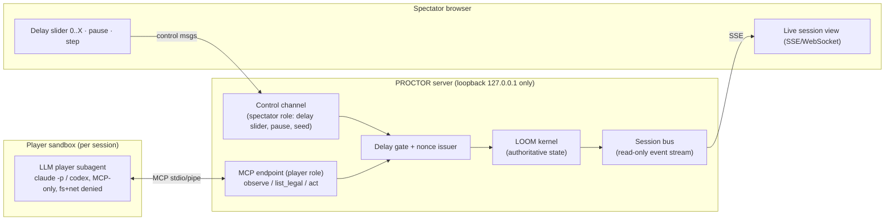

# PROCTOR — The MCP-Only, Watchable, Delay-Gated Playtest Harness

> **The stipulation:** *all* playtesting happens through an MCP server that LLM player subagents drive
> turn-by-turn; every session is viewable live in a browser; there is an inter-turn delay (0 → X
> seconds) that is **not** settable from a file the player can touch; the point is to **watch real
> play, not a model "simulating" the game because it knows the code.** PROCTOR is the answer.
>
> A "proctor" supervises an exam to prevent cheating — that is exactly this component's job.

## 0. My reading of the delay requirement (stated so you can correct it)

You said the delay is "a timer that I can't adjust in a file, between 0 and X seconds." I'm building it
as: **a live value the human controls from the browser (a 0…X slider), held in the server process and
enforced server-side — deliberately NOT read from any config file**, so (a) you tune pacing live while
watching, and (b) the player agent has no file or channel through which to shorten it. `X` (the max) is
fixed at server launch (CLI flag / env at start, before any player connects). If you actually meant
"fixed at launch, not adjustable at all during a run," that's a one-line change (drop the control
channel). Proceeding with the live-slider interpretation.

## 1. Threat model — what "playing for real, not simulating" must defeat

| # | Cheat | Defense |
|---|---|---|
| T1 | Player reads engine source / content YAML and knows answers | **Blind sandbox**: player launched with no `Read/Write/Edit/Bash/Glob/Grep/WebFetch/Task` and `--strict-mcp-config`; the MCP server is its *only* tool (reuse `zork-unlimited/blind-tester/run.sh`). |
| T2 | Player calls debug/full-state tools to peek beyond a fair player's view | **Role-gated toolsets**: the `player` role's MCP surface is only `observe / list_legal_actions / act`. `get_state`, `save_game`, `inspect_trace` exist only on `spectator`/`author` roles and are *absent* from the player connection. |
| T3 | Player "simulates" the whole run in its head and emits a transcript without round-tripping each turn through the live engine | **Per-turn nonce**: every observation carries a fresh server-issued `turn_nonce`; `act` is rejected unless it echoes the current nonce. A turn cannot be produced without having received that turn's live observation, in order. |
| T4 | Player races ahead / fakes wall-clock pacing | **Server-side delay gate**: `act` is blocked until `now ≥ last_commit_time + delay`. The wait happens inside the kernel process; the agent cannot observe a way to skip it. |
| T5 | Player predicts outcomes because it knows the rules | **Masked observations + recorded random tape**: hidden info (enemy hp, locked destinations, unseen clues) is never in the observation, and stochastic outcomes are drawn server-side — so even perfect rules knowledge can't pre-compute the next state. |
| T6 | Human can't tell if it was real | **Browser live-view**: observations, chosen actions, prose, the random draws, and the delay countdown stream to a read-only browser view in real time. You watch it happen. |

The combination is the point: T1/T2 make the player *blind*, T3/T5 make each turn *unforgeable and
unpredictable*, T4 makes it *wall-clock real*, T6 makes it *witnessable*.

## 2. Components



- **PROCTOR server** owns the kernel and the `SessionStore` (upgrade of `zork-unlimited/src/mcp/sessions.ts`).
  Binds **loopback only** (`127.0.0.1`, never `0.0.0.0`) — directly reusing the AI Launchpad security
  model in this folder's `GOAL.md` §7.1.
- **Player channel** = MCP, `player` role, 3 tools (§3).
- **Spectator channel** = read-only SSE/WebSocket of the committed event stream + a small control
  channel for the human's delay slider / pause / single-step. **Separate transport from the player** —
  the player cannot reach it.
- **Player sandbox** = the blind launcher (§5).

## 3. Player MCP tool contract (the entire surface a player sees)

```jsonc
// observe(session_id) -> the masked, role-scoped view of the current turn
{ "turn": 17, "turn_nonce": "n_8f3a…",            // MUST be echoed in the next act()
  "scene": "prose rendered from committed facts",
  "you": { "visible_self_state": { /* only what a fair player sees */ } },
  "world": { /* canonical facts you are permitted to know */ },
  "delay_remaining_ms": 0 }                         // 0 means you may act now

// list_legal_actions(session_id) -> ONLY currently legal actions (illegal ids never reach the kernel)
{ "turn_nonce": "n_8f3a…", "actions": [ { "id": "a1", "label": "search the desk" }, … ] }

// act(session_id, turn_nonce, action) -> result OR a structured rejection
//   rejections (never silent): WRONG_NONCE | NOT_LEGAL | DELAY_NOT_ELAPSED | SESSION_OVER
{ "ok": true, "committed_event_index": 412, "next": { /* the next observe() payload */ } }
```

That is all. No tool returns hidden state. No tool sets the delay. No tool reads the filesystem.

## 4. Tamper-proof delay — server-side gate (pseudocode)

```ts
// Held in the server process. NOT in any file the player tool-set can write.
// X_MAX is fixed at launch; `current` is moved live by the human via the control channel.
const delay = { X_MAX_MS: launchFlag("--max-delay-ms", 60000), current_ms: 0 };
controlChannel.on("set_delay", ({ ms, role }) => {        // spectator/author only
  if (role !== "spectator" && role !== "author") return reject();
  delay.current_ms = clamp(ms, 0, delay.X_MAX_MS);         // human-driven, live
});

function onAct(session, nonce, action) {
  if (nonce !== session.turn_nonce)        return reject("WRONG_NONCE");        // T3
  if (!session.legalIds.has(action.id))    return reject("NOT_LEGAL");         // T2/legality
  const ready = session.lastCommitAt + delay.current_ms;
  if (now() < ready) return reject("DELAY_NOT_ELAPSED", { retry_after_ms: ready - now() });  // T4
  const result = kernel.commit(session, action);           // §7 pipeline in 01-ARCHITECTURE
  session.turn_nonce = issueNonce();                        // rotate — last turn's nonce is now dead
  session.lastCommitAt = now();
  bus.publish(session.id, result.event);                    // → browser live-view (T6)
  return ok(result);
}
```

Why this is sound: the delay lives in process memory set via a channel the player role cannot address;
the player's only verbs are observe/list/act; `act` physically returns `DELAY_NOT_ELAPSED` until the
wall-clock passes. The agent can poll, but it cannot advance the clock, cannot find a file to edit,
and cannot fast-forward — and you can *see* the countdown in the browser.

## 5. Blind player launcher (reuse + harden `blind-tester/run.sh`)

```
proctor play \
  --pack <module-set> --seed <n> --role player \
  --player-cmd 'claude -p --strict-mcp-config --mcp-config ./proctor.mcp.json \
                --disallowedTools Read Edit Write Bash Glob Grep WebFetch WebSearch Task NotebookEdit' \
  --cwd <fresh temp dir with NO repo files>          # T1: nothing local to read
```

The player process starts in an empty temp cwd, with only the PROCTOR MCP server configured, all
file/shell/web tools denied. Its entire knowable universe is the observation stream.

## 6. Browser live-view (the net-new piece — `zork-unlimited` has none)

A small loopback web app (the `ui/engine.ts` `View` normalization in `zork-unlimited` is reusable for
rendering; the transport is new):

- **Live feed (SSE/WebSocket, read-only):** for each committed event — turn #, the player's chosen
  action, the prose, the *random tape draws* that turn (so you see the dice), the resulting public
  facts, and the masked observation the player actually received (so you can confirm it wasn't fed
  hidden info).
- **Pacing controls (spectator role):** the **0…X delay slider**, plus **pause** and **single-step**
  for when you want to scrutinize a turn.
- **Provenance panel:** session seed, module versions + content hashes, prior/next state hashes per
  turn — so a session is reproducible and you can later `replay` it deterministically.
- **Multi-session grid:** watch several player subagents play in parallel (each its own sandbox).

Infra reuse from this folder's AI Launchpad `GOAL.md`/`ROADMAP.md` (it is literally the user's proven
"local browser tool that manages processes" playbook): loopback-only bind (§7.1), **HTTP-poll
readiness** before flipping a session to `running` (§6.6), **`tree-kill`** to reap player processes
with zero orphans (§6.4/§7.4), **fail-loud distinct states** for crash/timeout/over (§5), and
`spawn` with array args + allowlist (no shell injection, §7.2).

## 7. How a session proves it was "real"

Every session emits a signed **session manifest**: ordered event log with per-turn `{nonce_issued,
nonce_echoed, observation_hash, action, random_tape, prior_hash, next_hash, wall_clock_gap_ms}`.
Three independent checks make "I simulated it because I know the code" detectable:

1. **Nonce chain intact** — every `act` echoed the nonce from the immediately preceding `observe`;
   gaps/reuse ⇒ the player didn't round-trip live. (T3)
2. **Wall-clock gaps ≥ delay** — each turn's `wall_clock_gap_ms ≥ delay_at_that_time`; impossible to
   forge because the server stamps commit times. (T4)
3. **Determinism on replay** — feeding the recorded actions + random tape back through the kernel
   reproduces identical `next_hash` values (reuse `src/core/hash.ts`, `src/trace/replay.ts`). Proves
   the live run was the real engine, not a hand-authored transcript.

A session that fails any check is flagged — exactly the runnable, observable blind-playtest oracle
that AdventureForge claimed but couldn't actually gate on.

## 8. What this fixes vs. AdventureForge
- ✅ Tamper-proof inter-turn delay (it had **none**).
- ✅ Browser live-view of an agent playing (it had **none** — `ui/` is human-click only).
- ✅ Role-gated tools so a "player" can't read full state (it relied on prompt instructions).
- ✅ CYOA hidden-info masking made real (its `hideGraph` was a no-op).
- ✅ Nonce + wall-clock + replay = a *provable* "this was real play" oracle, runnable in CI.
