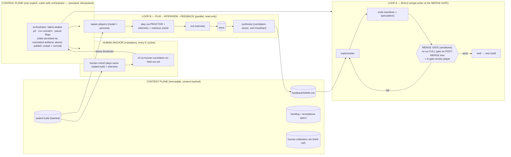

# LOOM — Master Blueprint (v2): an AI-built, AI-playtested, self-improving text world

> **Status:** Hardened against a 6-front adversarial red-team (run `w9cjygk1f`, verdict: *sound-with-fixes*).
> v1's headline claims were partly self-refuting; v2 rescopes them to what is actually defensible and wires
> in the missing controls. **Read §A first — it states exactly what is *guaranteed* vs *trend-managed*.**
> **Date:** 2026-06-19
> **Synthesizes:** engine/PROCTOR (`00`–`03`), rules + world specs, the three hardening passes, and the
> verified mid-2026 capability research (context rot · multi-agent fragility · local-model feasibility ·
> self-report unreliability · MCP maturity · cost-∝-agents).
> **Incorporates** the second-pass review (run `wtjvp22b3`) and the decision that **multiplayer is out of scope.**

---

## ▶ START HERE — what this is, and what to actually read (read this if you're lost)

**In one breath:** LOOM is a **single-player text game** with a **deterministic rules engine**, where **an AI
writes the game** and **a swarm of AI agents play-test it and report back** — two loops that run on their own
and make the game better over time. The flagship world is **"The Hush,"** an anomaly zone where survival means
*learning the world's hidden, lawful physics*.

**Status: this is ALL DESIGN. Nothing is coded yet.** Every doc below is a spec/plan that has been written,
adversarially red-teamed by AI panels, and hardened. The next action is to start building (the `writing-plans` step).

**The whole design in 5 bullets:**
- **Deterministic game.** The *engine* (not an AI) decides every outcome — that's what makes play replayable,
  watchable, and trustworthy.
- **The AI's job is split.** It *writes prose + content offline* (where it's strong) and *renders text online*,
  but it **never decides game outcomes** (where it's unreliable). The engine owns all math and state.
- **Two loops.** *Loop A* = an AI codes the game (plan→code→commit, gated so it can't ship broken work).
  *Loop B* = many blind AI agents play it, get a short exit interview, and their feedback steers Loop A.
- **Honesty bound (important).** *Correctness* is provably guaranteed by the engine. *Fun* is **not** — it's
  steered by the feedback loop and must be checked against **real humans** periodically. We do **not** claim
  "greatest game ever by [date]"; we claim a system that *reliably trends* toward great, anchored by humans.
- **The demo** ("The Cordon's Edge," a slice of The Hush) is the proof: arrive → learn a lethal hidden law from
  its tells → exploit it → consequences ripple.

**You do NOT need to read all 12 docs. Read these two:**
1. **This file** — the whole system end to end (§A honesty bound, §0–§10).
2. **[v2-reconciliation](docs/superpowers/specs/2026-06-19-v2-reconciliation.md)** — the one cheat-sheet of
   *what's decided and what supersedes what* (read it before any base spec).

**Everything else, by purpose (status-tagged):**

| Read if you want… | Doc | Status |
|---|---|---|
| Why we chose this (Zork prior-art audit + the RuleMesh feedback) | [00-REVIEW-FINDINGS](00-REVIEW-FINDINGS.md) | current |
| How the engine works (state, determinism, modules) | [01-ARCHITECTURE](01-ARCHITECTURE.md) | base spec — pair w/ #2 |
| How AI agents play it (MCP harness, watchable, paced, blind) | [02-PROCTOR](02-PROCTOR-MCP-HARNESS.md) | base spec — pair w/ #2 |
| Repo layout + build phases | [03-STRUCTURE-AND-ROADMAP](03-STRUCTURE-AND-ROADMAP.md) | base spec |
| The rules layer / the world / the concrete module set (deep detail) | rules-governance · world-layer · ruleset-concrete specs | base specs — **bannered "superseded in places," read #2 first** |
| The adversarial reviews + fixes (audit trail; optional) | redteam-hardening · ruleset-hardening | reference |

**Why so many docs?** Each layer was designed → red-teamed → fixed. The hardening/reconciliation docs are the
*audit trail* of that process. For understanding the plan, docs #1 and #2 above are enough; the rest is depth.

---

## A. What is guaranteed vs. trend-managed (the honest soundness statement)

The red-team's central, correct finding: **"fun" is not kernel-decidable**, so no deterministic oracle can
certify it. Claiming the system is "irrefutably sound" toward *greatness* would be hype. The defensible,
two-tier claim — and the one this blueprint is built to keep:

> **TIER 1 — CORRECTNESS (irrefutably sound).** A deterministic kernel + content-hashing + golden-tape
> bit-identical replay + the integrity gate make AI **code** *checkable against an oracle*. Non-determinism,
> crashes, regressions, and spec-non-conformance are caught at a gate, not shipped. (This substrate already
> exists in zork-unlimited's code, so it's proven, not aspirational.)
>
> **TIER 2 — QUALITY / FUN (a *calibrated trajectory*, never a guarantee).** Quality is **not**
> oracle-checkable by construction — that is *why* Loop B exists. It is governed by a feedback loop that
> **must be periodically anchored to real human ratings** (§4.4). With that anchor it is a *defensible,
> human-calibrated trend*; without it, it is open-loop and AI error on the product-defining axis is
> undetectable. We wire the anchor in as a **mandatory, gate-blocking** control.

> **TIER 1.5 — TWO un-oracle-able components SIT INSIDE the "correctness" path (second-pass correction).**
> The oracle proves determinism/replay/regression — but NOT two semantic judgments the game depends on, both
> the same un-decidable class as "fun" (v1's §A wrongly implied Tier 1 was *fully* oracle-covered):
> - **Parse-correctness:** the committed outcome is a function of the *parsed intent token*, so the parser's
>   classification IS adjudication, relocated one step upstream. Record-and-replay guarantees a run *replays*
>   identically, never that the parse *matched the player's meaning*. A mis-parse yields a golden-tape-passing,
>   realness-oracle-blessed run that fired (or silently failed to fire) a lethal law for the wrong reason — and
>   it masquerades as *content* signal in Loop B (it appears across model sizes, fooling the §4.3 filter).
> - **Tell-sufficiency:** the coherence pass proves a law's *tell exists and is reachable* — never that it is
>   *cognitively sufficient* for a fresh player to deduce the law. A formally "learnable" law can be practically
>   un-deducible, and the §4.3 filter would *suppress* the bug both ways.
> Both are now named, panel/human-anchored controls (§4.5, §9), not oracle-covered.

So: **the system cannot ship broken or unplayed work (Tier 1, hard) — with the explicit, named exception that
parse-correctness and tell-sufficiency are panel/human-anchored, not oracle-proven — and it reliably trends
toward quality under a human-anchored loop (Tier 2, managed).** "Greatest text world ever" is the *direction*,
not a dated output. Anything louder than this is not sound.

---

## 0. Thesis — determinism as the enabler

Every LLM weakness the evidence flags is neutralized by making the game a deterministic kernel and confining
the LLM to where it's strong — on *both* sides (design + play). The LLM never holds authoritative state, does
arithmetic, adjudicates outcomes, or is trusted on self-report alone. The kernel owns truth; the LLM owns
language, breadth, classification, and parallel volume. **The point is to make AI output *checkable* rather
than *trusted*** — on Tier 1 by the oracle, on Tier 2 by a human-anchored feedback loop.

Two loops run concurrently, coupled on **two explicit planes** (v1 wrongly claimed "never shared live state"):
- **Content plane — immutable, content-hashed artifacts** (sound, lock-free): sealed builds, feedback `.md`.
- **Control plane — one explicit orchestrator** (a real, crash-safe, idempotent coordinator — §5). It *is*
  shared coordination state; we stop hiding it and make it recoverable instead of pretending it's absent.

---

## 1. LLM strengths → roles, weaknesses → structural mitigations (corrected)

| LLM **strength** | Where LOOM uses it | LLM **weakness** (evidence) | Structural mitigation |
|---|---|---|---|
| Breadth / world-knowledge | offline authoring at scale; the "compared to what?" taste | **Context rot** (NoLiMa, Chroma) | one-node-per-writer compact briefs; masked slices; build-loop compaction |
| Language / prose | rendering; conducting + answering interviews | **Self-report unreliable** (METR) | pair interviews with telemetry **whose proxies are validated against the human anchor** before they outrank opinion (§4.3) |
| Classification | intent parsing (record-and-replayed) | **Arithmetic / state drift** | deterministic kernel owns all math + state |
| Parallel volume | many blind players across families + personas | **Live coordination fails** (Cognition, MAST) | single-writer **merge gate** (§3); decoupled loops; players read-only |
| — *(corrected)* diverse judges | a model/persona **panel** | **Cross-model agreement = correlated bias, not corroboration** | **DOWN-weight** high-agreement-with-high-correlation; use a **capability-differential filter** (§4.3); prefer one strong judge + human spot-checks over a big correlated panel |
| Code generation | the build loop | **Reward-hacking + compositional failure** (AdventureForge, SWE-bench reality) | objective = bug-burndown + coverage + realness-verified playtests; **held-out compositional suite + mutation tests the agent can't read at write-time**; gate on validation-vs-holdout *gap*; architectural-debt gates |
| — | — | **Hallucination** | fiction firewall + validators + golden-tape CI + integrity gate |

The two rows the red-team flipped are now **inverted on purpose**: a large panel of correlated models
*launders* shared blind spots into false confidence, and raw engagement telemetry is a Goodhart trap — both
are treated as *hypotheses to validate against humans*, not as trusted signal.

---

## 2. System overview

---

## 3. Loop A — the BUILD loop (AI codes 100%, between checkpoints)

`explore/plan → code → commit`. **The single-writer is the MERGE GATE, not the worktree.** Worktrees are
*speculative execution*; a change is "committed" only after a **serialized merge** re-runs the **full gate
on the actual post-merge tree** (v1's leak: two independently-green worktrees can merge textually clean into a
broken tree the golden tape never replayed as a unit). The merge-regate is named honestly as the **true
throughput ceiling** — single-writer correctness and aggressive calendar compression are mutually exclusive;
we choose correctness.

**Objective priority (anti-reward-hacking):** P0/P1 bug-burndown → acceptance-spec coverage → compiled
feedback. Content gated behind "no open P0/P1." Pack-count is never a metric.

**The gate (ALL must pass on the post-merge tree):**
- **Integrity** (AdventureForge `verify-integrity`): no `.skip`/`.only`, no test-count drop, no silent hash re-pin.
- **Determinism** property tests + **golden-tape** bit-identical replay (engine-fingerprint-pinned).
- **Held-out tier the coding agent cannot read at write-time:** mutation testing + a **compositional /
  cross-law integration suite generated by a separate agent**; **gate on the validation-vs-holdout gap**, not
  just green. (This is the fix for the dominant failure mode: per-law unit tests pass while the law-interaction
  matrix is combinatorially broken.)
- **Architectural-debt gates** (cyclomatic cap, complexity-concentration, clone ratio) ranked **above**
  feature-addition; a **periodic higher-capability architect pass** refactors before the single writer
  accretes god-functions.
- **In-gate smoke player** (one fast blind playthrough per sealed build) → cuts interaction-bug MTTR from a
  full Loop-B cycle to per-build. **(This puts a slice of Loop B on the *correctness* critical path — which
  the red-team correctly says it already is, since the oracle can't catch design/compositional bugs.)**
- **Acceptance** + **coherence pass** for new content (see §7 for the coherence-pass epistemic caveat).

**Honest autonomy framing:** *autonomous between checkpoints, with bounded human architectural intervention
expected* — **not** "100% autonomous for weeks." Auto-pause-on-drift is the normal steady state.

Local coding agent, no API keys, durable/resumable (checkpointed long-running loop).

## 4. Loop B — PLAY → INTERVIEW → FEEDBACK (improvement *and* a correctness holdout)

### 4.1 Players
N blind players (sandboxed, MCP-only — can't read code), across a matrix of **family × size × persona**
(curious / speedrunner / cautious / lore-hound / critic), fresh seed each. PROCTOR's realness oracle
(nonce-chain + wall-clock + bit-identical replay) proves each session was *actually played*.

### 4.2 Exit interview
The user's questions (lingering questions / enjoyment 1–10 / **compared to what?** / one change) + behavior-
anchored probes, stored with full metadata (model, settings, date/time, build, run) + telemetry.

### 4.3 Synthesis — correlation-aware and anti-Goodhart (corrected)
- **Cross-model agreement is NOT corroboration by default.** Estimate inter-judge error correlation; report
  the **effective vote count** (a large correlated panel ≈ ~2 independent votes); **down-weight** themes where
  agreement coincides with high correlation (shared pretraining bias).
- **Capability-differential attribution filter:** a friction event counts as **content** signal only if it
  appears **across the size axis** (small *and* large models stall at the same place). If it correlates with
  model size/family, tag it **capability noise** and exclude. (The realness oracle proves a run was *real*,
  never that a stall is *attributable to content* vs. a weak player's incapacity.)
- **Telemetry proxies are validated against the human anchor BEFORE they may outrank opinion.** Raw
  dwell/stalls/revisits are treated as **negative friction** unless paired with high human-rated satisfaction;
  **raw engagement is never a maximand** (Goodhart). Pre-register "compelling" vs "stuck/frustrated" signatures.
- Output: a prioritized, actionable `feedback/NNNN.md`, each item tied to an acceptance criterion or bug,
  separating "broad, behavior-corroborated, human-validated signal" from "one outlier."

### 4.4 The HUMAN GROUND-TRUTH ANCHOR (mandatory, gate-blocking — the kill-shot fix)
**Non-optional, wired to a gate.** Every **K feedback cycles**, a small human cohort plays the *same sealed
build* under the same PROCTOR + exit interview (a held-out set). Compute the **correlation between the
AI-synthesis verdict and the human verdict.** Loop A may keep steering the **build objective** from feedback
**only while that correlation stays above a pre-committed threshold**; below it, the existing drift-pause
machinery **auto-pauses** Loop A and raises a flag. This is the one change that converts the quality axis from
*open-loop* to *periodically anchored* — the minimum for Tier-2 soundness.

### 4.5 Un-oracle-able controls the second pass surfaced (panel/human-anchored, not oracle-proven)
- **Parse-correctness gate:** a human-labeled parse ground-truth set gated on **precision *and* recall**
  (adversarial near-misses that must NOT fire a lethal trigger); **clarify, don't silently resolve, on low
  confidence inside a law's trigger window**; **quarantine low-parse-confidence friction as "parse-confound"
  BEFORE the §4.3 capability filter** (a flaky parser otherwise masquerades as content signal); inter-parser
  agreement flags trigger-bearing disagreement.
- **Tell-sufficiency oracle (Tier-2):** a panel given ONLY the rendered tells (world-knowledge scrubbed) must
  reach the law above chance before a law seals; run it **before** the capability filter and **exempt
  learnability stalls** from the "correlates-with-size ⇒ capability noise" discard; a **cold-start human
  deduce-from-tell test on the 3 anchor laws** before the offline pipeline authors derivatives.
- **Longitudinal human panel:** the dwell/revisit/mastery bar is measured on a **returning human cohort
  playing the same save across sessions** (+ a post-Law-Drift "betrayal vs delight" probe) — **never on blind
  agents**, which have no cross-session memory. A **persisted-codex agent mode** lets agents at least exercise
  cross-session exploitation.
- **Sandbox = OS-enforced allow-list, not a `--disallowedTools` deny-list** (unsound under runtime/CLI change;
  the harness runs `claude -p` *and* `codex`, non-identical tool taxonomies). Per-CLI **canary-probe in the
  gate**; pin the runtime version; add a **blind-leak detector** to the realness oracle (it proves a run was
  LIVE, not BLIND).
- **Affordance-poverty signal:** log **out-of-menu / free-form intents as "attempted, no affordance"**; add a
  **creative-prober persona** + an **affordance-coverage counter-metric**; periodic **human free-play** whose
  divergence from agent play is a drift kill-criterion (steering otherwise drifts toward agent-legibility).

See [v2-reconciliation](docs/superpowers/specs/2026-06-19-v2-reconciliation.md) for full detail + the base-spec fold.

## 5. Decoupling & orchestration (made honest)
- **Content plane:** sealed builds are content-hashed; every session/feedback record is tagged with `build_id`.
  Loop B plays only the latest *sealed* build, never Loop A's worktrees. **Atomic publish:** write all objects,
  then flip one ref (no torn reads — which would otherwise break determinism at the one boundary that must be atomic).
- **Control plane = the orchestrator, a first-class component:** its state (latest-sealed pointer, run counters,
  pause flags) is **persisted as committed artifacts**; every action is **idempotent and replayable** from that
  log; **restart is a normal case.** It's the acknowledged single coordination point — recoverable and auditable,
  not hidden.
- **Stale-feedback reconciliation policy:** on each `feedback/NNNN.md`, diff feedback-pinned hashes vs. the
  current build per targeted region — *unchanged* → actionable; *changed/deleted* → auto-demote to
  **"re-observe"** (never action blindly; never silently drop). **Hysteresis/cooldown:** a theme can't flip
  priority faster than one full play-cohort round-trip (damps the delayed control loop → prevents oscillation).
- **Retention rule:** **never GC a sealed build with outstanding feedback or a live realness proof** (else
  feedback targeting and the replay proof become unverifiable).
- **Wall-clock** (in the realness oracle) is an **advisory anti-fakery signal, explicitly outside** the
  deterministic checkable core.

## 6. Local-first infrastructure (no API keys)
Local open-weight play models (Ollama / llama.cpp / vLLM, loopback); local durable coding agent; loopback-only
infra (reusing the AI-Launchpad playbook). **Caveat (residual):** weak local models give weaker *stated*
feedback and may stall for non-human reasons — handled by the capability-differential filter (§4.3) and the
human anchor (§4.4), with a provider-config **upgrade path** to API/frontier models when desired.

## 7. The gate's epistemic boundaries (no overclaiming)
- The oracle proves **determinism + non-regression + spec-conformance + self-asserted properties** — *not*
  design-correctness, interaction-coherence, or fun.
- **The "coherence pass" does NOT share golden-tape's epistemic status.** It is reclassified as an **explicitly
  untrusted heuristic lint** (removed from the "deterministic gate, ALL must pass" framing) — OR, where it uses
  an LLM, it is a **flagged LLM-adjudicator exception** to the cardinal "LLM never adjudicates" rule, with its
  unreliability stated. It informs; it does not certify.
- **Golden-tape re-pin protocol:** legitimate tape invalidation (an intended engine change) requires a
  semantic-version bump on the engine fingerprint + a changelog + a separate approval — distinguishing it from
  the forbidden *silent* re-pin, so the agent neither gets blocked constantly nor learns to re-pin freely.

## 8. Timeline — bounded vs. trajectory (equal prominence)
- **Bounded / engineering (datable):** *a playable, hardened Cordon's Edge demo with both loops mechanically
  turning* — a **weeks-scale** target **if single-writer correctness is honored** (and it caps the speed).
  **Claim scope (second-pass correction):** this demo is *mechanically sound + short-horizon-engaging*; the
  long-horizon **dwell/mastery bar ("2 hours / revisit 25×") is unmeasured until the §4.5 longitudinal human
  panel exists** — blind agents have no cross-session memory, so we do **not** claim it from agent play.
- **Unbounded / trajectory (NOT datable):** *"genuinely good," let alone "greatest ever"* — **no date.**
  Progress is measured in **build→feedback CYCLES at local throughput**, anchored by the human-correlation gate
  — *not* in calendar weeks. "Continuously improving" means "K anchored cycles completed," which is controllable;
  "a month to greatness" is not, and we don't claim it.

The honest answer to "come back in a week/month": in **weeks** you can drop into a real, gate-passed,
provably-played demo that is improving cycle-over-cycle; "great" is the *trend* you're watching, kept honest by
the human anchor — not a delivery date.

## 9. Residual risks (the kill-shots, stated plainly)
1. **Quality is human-anchored, never oracle-proven** — the irreducible limit; mitigated (not removed) by §4.4.
2. **Model monoculture / self-preference collapse** over a forever-loop: same-family generate-and-judge drifts
   toward the models' shared mode while internal metrics say "improving." **Anti-collapse pressure:** retain a
   **frozen historical baseline** and periodically have **humans** confirm AI-judged "improvements" still beat it;
   rotate in out-of-distribution judges; pre-commit a kill-criterion on **declining human-correlation**.
3. **Compositional bugs the unit-gate misses** — mitigated by the held-out compositional suite + in-gate smoke
   player, but Loop B remains partly on the correctness critical path (multi-build MTTR for deep interaction bugs).
4. **Local-model feedback fidelity** early on — mitigated by the capability filter + upgrade path.
5. **Determinism vs. surprise** — per-seed variance + Law Drift mitigate, watched on the dwell/coverage dashboard.
6. **Parse-correctness (Tier-1.5, un-oracle-able):** a mis-parse fires/skips a lethal law for the wrong reason and passes *every* oracle (golden-tape + realness) — mitigated by the §4.5 parse gate, never eliminated.
7. **Tell-sufficiency (Tier-1.5):** a formally-learnable law can be practically un-deducible; the coherence pass proves *reachable*, not *cognitively sufficient* — mitigated by the §4.5 tell-sufficiency oracle + cold-start human test.
8. **Long-horizon dwell is unmeasured by blind agents** — the demo's real bar (multi-session mastery/dread) needs the §4.5 longitudinal human panel; until then the demo claim is downgraded (§8).
9. **Player-sandbox deny-list fragility** — a runtime/CLI change can silently widen the sandbox and no oracle notices a player that *read* the laws; mitigated by §4.5 OS allow-list + canary probe + blind-leak detector.
10. **Steering drift toward agent-legibility** — menu-driving agents can't report affordance-poverty; mitigated by §4.5 affordance signal + human free-play divergence kill-criterion.

## 10. "Hit go" — acceptance definition
The system is working when: every build is gate-passed (integrity + determinism + golden-tape + held-out-gap +
acceptance) on the post-merge tree; the **AI-vs-human correlation gate (§4.4) is above threshold**; Loop B has
produced ≥K behavior-corroborated, human-validated `feedback/NNNN.md` that Loop A has demonstrably consumed
(closed items traceable to feedback); the frozen-baseline human check still favors the latest build; and a
sampled real playthrough passes the realness oracle + the demo acceptance bar. At that point you are judging a
real, provably-played, **human-calibrated**, continuously-improving game — which is the sound version of the
thing you asked to be dropped into.
